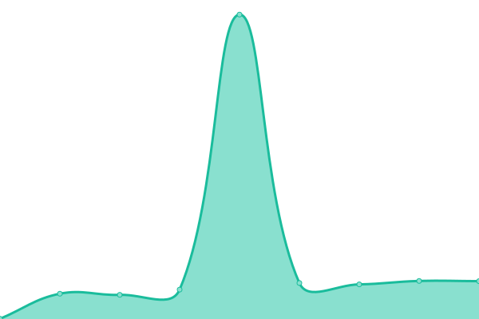
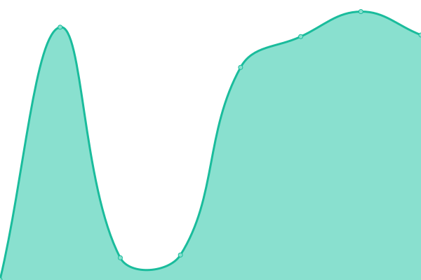

# 

<!--start: status pages-->
<!-- This summary is generated by Upptime (https://github.com/upptime/upptime) -->
<!-- Do not edit this manually, your changes will be overwritten -->
<!-- prettier-ignore -->
| URL | Status | History | Response Time | Uptime |
| --- | ------ | ------- | ------------- | ------ |
|  [Businesses, Modules, Products, Services, Orders](https://api.trinitisolutions.nl/v1/Businesses/trinitisolutions) | 🟩 Up | [businesses-modules-products-services-orders.yml](https://github.com/trinitisolutions/triniti-uptime-monitor/commits/HEAD/history/businesses-modules-products-services-orders.yml) | 

 425ms
     
 | 

<a href="https://trinitisolutions.github.io/triniti-uptime-monitor/history/businesses-modules-products-services-orders">100.00%</a>
    

|  [Pages/Blocks](https://api.trinitisolutions.nl/v1/Pages/1) | 🟥 Down | [pages-blocks.yml](https://github.com/trinitisolutions/triniti-uptime-monitor/commits/HEAD/history/pages-blocks.yml) | 

 213ms
     
 | 

<a href="https://trinitisolutions.github.io/triniti-uptime-monitor/history/pages-blocks">54.15%</a>
    

|  [Images](https://api.trinitisolutions.nl/v1/images/imageUpload/fileUrl) | 🟩 Up | [images.yml](https://github.com/trinitisolutions/triniti-uptime-monitor/commits/HEAD/history/images.yml) | 

 121ms
     
 | 

<a href="https://trinitisolutions.github.io/triniti-uptime-monitor/history/images">100.00%</a>
    

|  [Appointments](https://api.trinitisolutions.nl/v1/appointments/1) | 🟩 Up | [appointments.yml](https://github.com/trinitisolutions/triniti-uptime-monitor/commits/HEAD/history/appointments.yml) | 

 122ms
     
 | 

<a href="https://trinitisolutions.github.io/triniti-uptime-monitor/history/appointments">100.00%</a>
    

|  [Appointments](https://api.trinitisolutions.nl/v1/appointments/1) | 🟩 Up | [appointments.yml](https://github.com/trinitisolutions/triniti-uptime-monitor/commits/HEAD/history/appointments.yml) | 

 122ms
     
 | 

<a href="https://trinitisolutions.github.io/triniti-uptime-monitor/history/appointments">100.00%</a>
    

|  [Reviews](https://api.trinitisolutions.nl/v1/likes) | 🟩 Up | [reviews.yml](https://github.com/trinitisolutions/triniti-uptime-monitor/commits/HEAD/history/reviews.yml) | 

 1045ms
     
 | 

<a href="https://trinitisolutions.github.io/triniti-uptime-monitor/history/reviews">100.00%</a>
    

|  [Calipso Service](https://api.trinitisolutions.nl/v1/Calipso/customers) | 🟩 Up | [calipso-service.yml](https://github.com/trinitisolutions/triniti-uptime-monitor/commits/HEAD/history/calipso-service.yml) | 

 135ms
     
 | 

<a href="https://trinitisolutions.github.io/triniti-uptime-monitor/history/calipso-service">100.00%</a>
    

<!--end: status pages-->

## 📄 License

- Powered by: [Upptime](https://github.com/upptime/upptime)
- Code: [MIT](./LICENSE) © [Triniti Solutions](www.trinitisolutions.nl)
- Data in the `./history` directory: [Open Database License](https://opendatacommons.org/licenses/odbl/1-0/)
