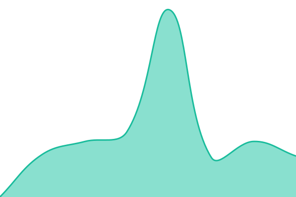

# 

<!--start: status pages-->
<!-- This summary is generated by Upptime (https://github.com/upptime/upptime) -->
<!-- Do not edit this manually, your changes will be overwritten -->
<!-- prettier-ignore -->
| URL | Status | History | Response Time | Uptime |
| --- | ------ | ------- | ------------- | ------ |
|  [Businesses, Modules, Products, Services, Orders](https://api.appset.nl/v1/Businesses/trinitisolutions) | 🟩 Up | [businesses-modules-products-services-orders.yml](https://github.com/trinitisolutions/triniti-uptime-monitor/commits/HEAD/history/businesses-modules-products-services-orders.yml) | 

 624ms
     
 | 

<a href="https://trinitisolutions.github.io/triniti-uptime-monitor/history/businesses-modules-products-services-orders">100.00%</a>
    

|  [Pages/Blocks](https://api.appset.nl/v1/pages/Businesses/trinitisolutions) | 🟩 Up | [pages-blocks.yml](https://github.com/trinitisolutions/triniti-uptime-monitor/commits/HEAD/history/pages-blocks.yml) | 

 453ms
     
 | 

<a href="https://trinitisolutions.github.io/triniti-uptime-monitor/history/pages-blocks">100.00%</a>
    

|  [Appointments](https://api.appset.nl/v1/businesses/trinitisolutions/AppointmentConfigurations) | 🟩 Up | [appointments.yml](https://github.com/trinitisolutions/triniti-uptime-monitor/commits/HEAD/history/appointments.yml) | 

 419ms
     
 | 

<a href="https://trinitisolutions.github.io/triniti-uptime-monitor/history/appointments">95.61%</a>
    

|  [Reviews](https://api.appset.nl/v1/likes?businessName=trinitisolutions) | 🟩 Up | [reviews.yml](https://github.com/trinitisolutions/triniti-uptime-monitor/commits/HEAD/history/reviews.yml) | 

 653ms
     
 | 

<a href="https://trinitisolutions.github.io/triniti-uptime-monitor/history/reviews">100.00%</a>
    

|  [Posts](https://api.appset.nl/v1/businesses/trinitisolutions/posts) | 🟩 Up | [posts.yml](https://github.com/trinitisolutions/triniti-uptime-monitor/commits/HEAD/history/posts.yml) | 

 729ms
     
 | 

<a href="https://trinitisolutions.github.io/triniti-uptime-monitor/history/posts">100.00%</a>
    

|  [Monitor](https://api.appset.nl/v1/events) | 🟩 Up | [monitor.yml](https://github.com/trinitisolutions/triniti-uptime-monitor/commits/HEAD/history/monitor.yml) | 

 403ms
     
 | 

<a href="https://trinitisolutions.github.io/triniti-uptime-monitor/history/monitor">100.00%</a>
    

|  [Notifications](https://api.appset.nl/v1/notifications/preferences) | 🟩 Up | [notifications.yml](https://github.com/trinitisolutions/triniti-uptime-monitor/commits/HEAD/history/notifications.yml) | 

 435ms
     
 | 

<a href="https://trinitisolutions.github.io/triniti-uptime-monitor/history/notifications">100.00%</a>
    

|  [PIMS kaas](https://api.appset.nl/v1/pimskaas/Subscriptions) | 🟩 Up | [pims-kaas.yml](https://github.com/trinitisolutions/triniti-uptime-monitor/commits/HEAD/history/pims-kaas.yml) | 

 406ms
     
 | 

<a href="https://trinitisolutions.github.io/triniti-uptime-monitor/history/pims-kaas">100.00%</a>
    

<!--end: status pages-->

## 📄 License

- Powered by: [Upptime](https://github.com/upptime/upptime)
- Code: [MIT](./LICENSE) © [Triniti Solutions](www.trinitisolutions.nl)
- Data in the `./history` directory: [Open Database License](https://opendatacommons.org/licenses/odbl/1-0/)
